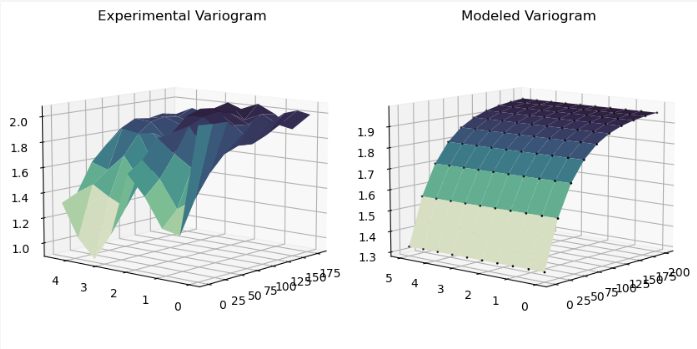
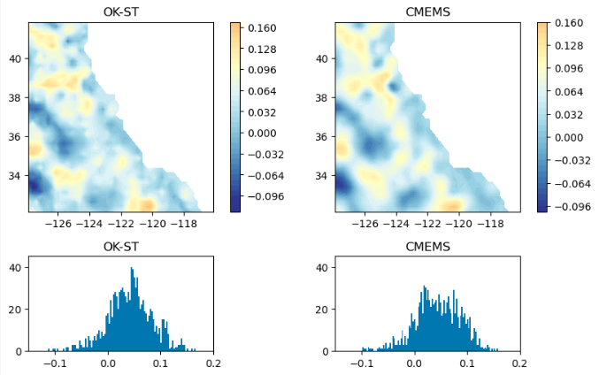

# **ST-Window Kriging** 
### **Spatio Temporal Window Kriging** for mapping daily Sea Level Anomalies from satellite altimetry along-track data (L3 to L4)

### Description 
The project **ST-Window-Kriging** available in Jupyter Notebook format can be used to produce daily Sea Level Anomalie Grids from along-track satellite altimetry data for California in 2018. The approach is based on Ordinary Kriging in a moving $\pm$ 5 days time window around the target day. Kriging is done building a empirical variogram from the observations (along-track data) and fitting a sum-metric semi-variogram model, which is the base for the Kriging matrix. The approach uses along-track data from CMEMS as input data (https://doi.org/10.48670/moi-00146) and produced gridded data icopmarable to their Maps (https://doi.org/10.48670/moi-00149).

### Installation 
Using git and pip: 

git clone https://github.com/mariejuhl/ST-Window-Kriging 

cd ST-Window-Kriging 

pip install -r requirements.txt

### Usage 
#### Dependencies
Dependecies need to be installed according to the Installation step above. In the main Notebook  **ST-Window-Kriging.ipynb** dependencies are loaded under **1. Import Dependencies**, where the main function are loaded from **tools.py**. 

#### Input data:
Input data are Sea Level Anomalies from along-track satellite altimetry (L3) in 1Hz, downloaded from Copernicus Marine Service (https://doi.org/10.48670/moi-00146). We collected them in a dataframe containing, e.g. for California all data within the year 2018 for the study region $\pm$2° latitude and longitude to avoid boundary effects. Input data used in this study are stored in the dorectory sample data. Data are loaded in the Notebook and prepared under **2. Input data, Area Selection, Mask and Subsampling**. '

#### Variogram 
In **ST-Window-Kriging.ipynb** variogram modelling is integrated in ST_Window_Kriging function. Select Kriging = False to only fir variogram. Otherwise the variogram will be build (matheron semi-variogram) and fitted (sum-metric model) using the ranges in time (ht_range) and space (hs_range). If plot is set to True, experimental variogram and model are plotted for each day. Since this process can take a while a processing bar will show the progress of the Kriging.

#### Daily Grids
The function ST_Window_Kriging will be excuted for all days in run_time, which can be defined under **3. Producing daily Maps**. Grids will be plotted alongside with the CMEMS L4 grid and can be stored as netcdf or csv (by giving a path to save_as_csv or save_as_netcdf in the function).

### Contact
mariechristin.juhl@tum.de